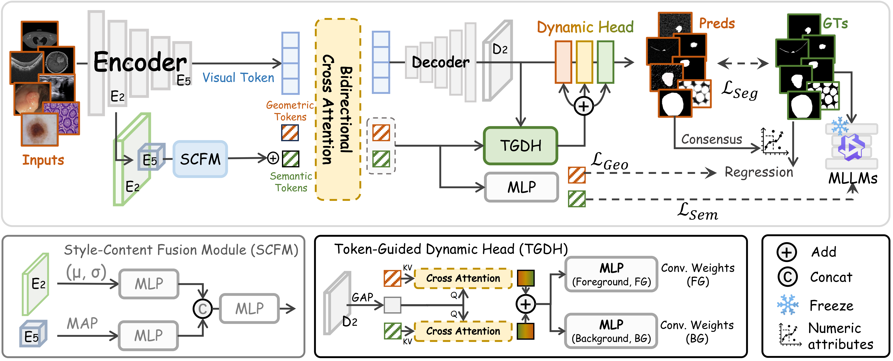

# Concept-to-Pixel: Prompt-Free Universal Medical Image Segmentation

## 🚀 Highlights
Unlike conventional U-Nets or recent in-context learning models (e.g., Spider, SR-ICL) that suffer from limited versatility or strict reliance on reference images, **Concept-to-Pixel (C2P)** is a fully automatic, prompt-free framework. 

* 🧠 **Explicit Decoupling:** We explicitly disentangle anatomical understanding into *Geometric Tokens* (capturing universal physical properties) and *Semantic Tokens* (capturing modality-dependent clinical knowledge distilled from MLLMs).
* 🎯 **Dynamic Adaptation:** A novel **Token-Guided Dynamic Head (TGDH)** synthesizes instance-specific convolutional kernels on the fly, tailoring decision boundaries for highly heterogeneous inputs.
* 🔥 **Exceptional Zero-Shot Generalization:** Achieves state-of-the-art (SOTA) performance on completely unseen datasets and macroscopic modalities (e.g., X-Ray, MRI) **without requiring any reference images (Zero-Ref)** or tedious manual prompts.

## 🧩 Architecture

  

Our framework consists of three core stages:
1. **Style-Content Fusion Module (SCFM):** Infers modality embeddings from shallow and deep backbone features and dynamically injects them into Semantic Tokens.
2. **Bidirectional Token-Image Interaction:** Universal Geometric Tokens and modality-aware Semantic Tokens deeply interact with visual features through Bidirectional Cross Attention.
3. **Token-Guided Dynamic Head (TGDH):** Aggregated concepts prompt a kernel generator to synthesize dynamic parameters for precise, instance-specific mask prediction.

